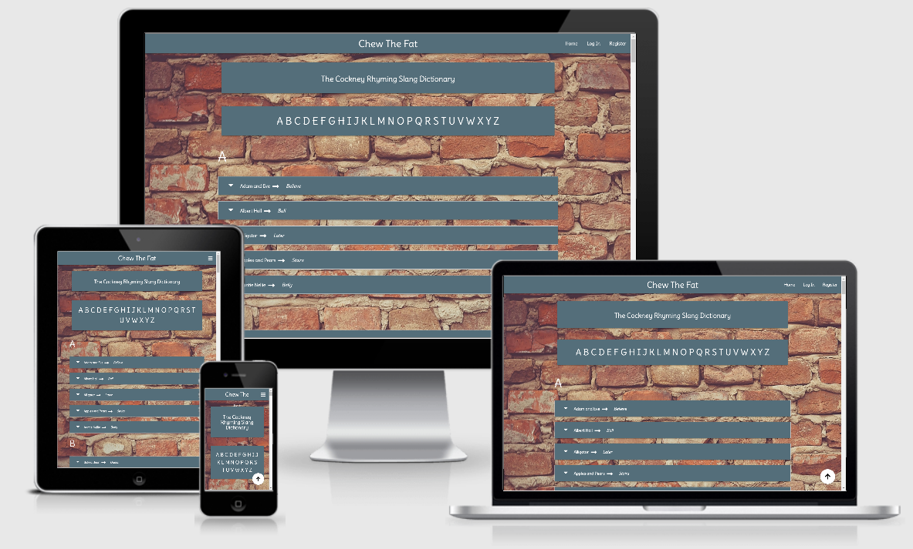
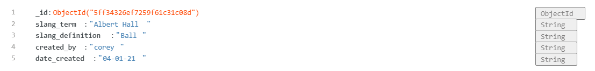
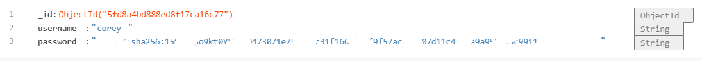

# Third Milestone Project - Chew The Fat

Welcome to Chew the Fat, a place for curious minds to learn Cockney Rhyming Slang, or for veterans in the art of speaking
Chitty Chitty Bang Bang (Cockney Rhyming Slang), to add to the ever expanding dictionary for all to see. Perhaps you've visited
London on a day trip, had a confusing conversation with a Black Cab driver, and thought "What was that all about?". Or maybe
heard a phrase on telly, most notoriously on Only Fools and Horses, and thought "What's a Pony?". This is where Chew The Fat
comes in!

I decided to make this site because I have always had a keen interest in Cockney Rhyming Slang and it's origins.
The language is believed to have been created for a few reasons, some of which include; market traders wanting to converse between
each other without onlookers knowing what is being said, providing a sense of community by having their own language only
locals knew, but the most common reason is known to be for criminals to communicate with each other without Police
knowing what is being said. What I find fascinating is that it is still used to this day, there are so many terms that we would all
use in our day to day conversations, not knowing that it is derived from Cockney Rhyming Slang. 

## Table of Contents

1. [UXD - User Experience Design](#1.-uxd---user-experience-design)
    * [Strategy](#strategy)
    * [User Stories](#user-stories)
    * [Scope Plane](#scope-plane)
    * [Structure Plane](#structure-plane)
    * [Skeleton Plane](#skeleton-plane)
    * [Wireframes](#wireframes)
    * [Surface Plane](#surface-plane)

2. [Features](#2.-features)
    * [Existing Features](#existing-features)
    * [Features left to implement](#features-left-to-implement)

3. [Technologies Used](#3.-technologies-used)

4. [Testing](#4.-testing)

5. [Deployment](#5.-deployment)
    * [How to run this project locally](#how-to-run-this-project-locally)

6. [Credits](#6.-credits)
    * [Content](#content)
    * [Media](#media)
    * [Code](#media)
    * [Acknowledgements](#acknowledgements)

## 1. UXD - User Experience Design

---

### Strategy

---

The purpose of this site is to create a dictionary of rhyming slang terms and their definitions, potential users may have heard 
a term that they are not familiar with and can find it on this site. Users are encouraged to make accounts and add terms/definitions 
to the site to expand on the ever-growing database. The site should be simplistic and have the information that the user is searching
for straight in front of them on the first page. There should also be minimal content to read from the start of the start, as the user
has come to this site for a quick answer to a question and are not there to read a backstory to the site's existence.

As the site owner, going forward, it would be great to turn it into more of a platform for socialising. Perhaps adding a forum/chat
funtionality. It could become a place for users to converse about London life, share experiences and of course continue to expand on
the Cockney Rhyming Slang dictionary. These actions can be implemented along side the main focus of the website being a dictionary, to
perhaps bring in revenuse by eventually advertising tourist attractions and forwarding users to ticket sales for these attractions as
an example.

#### User Stories

* As a new user I want to be presented with a simple, enjoyable and easy to use site, that is also visually appealing.
* As a new user I want to be able to navigate around the site with ease.
* As a new user I want to be able to easily find the slang term I am looking for, via a logical ordering system.
* As a new user I would like the option to add to the dictionary of slang terms.
* As a new user I want to have access to the slang terms/defintions i've created and have the option to edit/remove them.
* As a new user I want to enjoy using the site enough to want to return.
    
* As a returning user I want all the requirements as a new user.
* As a returning user I want to be able to see that any new slang terms have since been added in a logical order.

* As a frequent user, going forward I would like to be able to interact with other users on the site on a social level.
* As a frequent user, going forward I would like to be able to see recommendations for tourist attractions in London.

---

### Scope Plane

---

#### Functional Specifications

* The functional specifications will mostly follow the information set out in the user stories.

#### Content Requirements

* The user will be immediately faced with a simplistic site, with all the slang terms on the first page they reach.
* There will be easy to follow navigation with limited pages to choose depending on if the user is logged in or not.
* The Background will be fitting for the sites purpose and not distracting.
* The colour scheme and font choices used throughout the site will be complimentary of each other and display clearly for users
on all devices. The aim is not to be flambouyant in this case, the purpose is to provide clear and concise content for the user
and maintain consistent at all times.
* With simplicity in mind and taking into consideration all the points above, the site still needs to fill like it belongs to
it's purpose and makes sense. For example, it is a dictionary for a language originating from London, so a bright, rural theme/feel
probably wouldn't fit.
* The site will include it's main funtionality of being a dictionary search tool and, for users to be able to create accounts and
add slang terms themselves from the initial site creation. Future content could include forums, chat functionalities, advertising
or even sale of merchandise.

---

### Structure Plane

---

The site has been structured with the user in mind from the offset. Simplicity has been reiterated a lot so far but it has been
at the forefront of every idea and design aspect for this site. To achieve this, I decided to use Materialize as I think it
provides very straight-forward styling that is easily achieved. I will explain in more detail the structure of each component that
makes up the site in the following Skeleton Plane section, as I believe it links better with how the information is represented
via the wireframes. However, the basic structure logistically can be described in the following priorities:

1. The first page that is presented to the user is the Home page, which contains all the slang terms they have come to find.
2. The first page should be designed in such a way that makes it clear what it is straightaway.
3. The logo and navigation bar will be present at the very top of the page horizontally, logo central, navigation buttons to the right
with the most commonly used buttons/pages displayed left to right.
4. As the name of the site isn't inherently clear as to what the site does, the heading will displayed directly below the top nav-wrapper.
5. An alphabet that includes href links for users to navigate to slang terms beginning with the letter they choose will be displayed
next, before the dictionary begins.
6. The dictionary will then be displayed, with all terms separated by large headers of the corresponding starting letter to the term.
The slang term will come first, followed by it's definition. Each slang term will be within a materialize collapsable which displays
more information when clicked on, such as the name of the user who created the entry and the date it was created on.
7. The next page along in the navigation will be the Log In page, for user to log in and add slang entries..
8. The next page along in the navigation will be the register page, for users who wish to add slang entries to the site, they must
register an account to do this.
9. When a user is logged in the Add Slang page will appear on the navigation bar, this is to prevent users adding slang entries without
an account.
10. The other page that is available to users is their Profile page, here will be an explanation as to what a user has access to on the
site. Also available are navagation buttons to return back to the Home page or the option to Add Slang.
11. Lastly, the Log Out button will be available at the end of the navigation bar, only for users that are logged in, to log out.

---

### Skeleton Plane

---

I used Wireframes when designing how the information will be represented and how the user will be able to navigate across the site.
Once the wireframes were created, I had a clear direction on where to begin creating the site and what pages should be created thereafter.
As the contents of the dictionary and the information of the sites user accounts are stored as data and retrieved from a database, 
I also designed how the database would work for the site. I decided to use MongoDB which is a NoSQL document-oriented database.
The database is quite simple and named cockney_rhyming_slang, it is comprised of two collections, one named words and the other users. 
All the slang entries created are stored/retrieved in the words collections and all the user account details are stored/retrieved in the 
users collection. The structuring of these collections can be viewed in the images below:

cockney_rhyming_slang.words:

cockney_rhyming_slang.users:
(Password manipulated so cannot be seen)

#### Wireframes

You can find the pdf file to my Wireframes in the wireframe folder of this repository.

---

### Surface Plane

---

I've stated previously that I decided to use Materialize for styling this site along with utilising many of the options it had to
offer. When deciding on Typography I wanted to have a font that could be conceived as 'handwritten', as it is a site for words and
in a dictionary function, I thought a handwritten font would be quite apt. I used google fonts to find a suitable font that followed
the criteria I set out but was also clear to read, I eventually decided on the font [Delius](https://fonts.google.com/specimen/Delius?selection.family=Delius).

I decided on a background that would match the urban feel I was trying to achieve, so I searched for London brick wall backgrounds and
eventually found one I thought was suitable.

I tried to choose a colour scheme that would compliment the background but also so they did not clash, whilst making sure all content was
clear and visible. I ended up using materialize colour of blue-gray darken-1, Gray is neutral and tends to be quite a popular choice in
web design so it fit my criteria. I went with a traditional white font throughout the site apart from where backgrounds are white, I chose
the contrasting blue-gray. I also have multiple flash messages that appear throughout the site, I wanted these to be bold and stand out well,
so I chose the background colour of these to be yellow accent-4 with white font.

The site only has one image which is the background image, apart from that I have also used [font awesome](https://fontawesome.com/) icons
throughout the site as a visual aid for users.

---

## 2. Features

---

### Existing Features

---

### Base

I created a template called base.html to hold all the content that will be displayed on each page of the site. This way I can use jinja
templating language for all the other pages to inherit the code from base.html, then I only need to concentrate on the code/content
specific to that page. The base.html template declares that it's a html document and houses the head element that contains all the link 
tags for the site. The body element is also stored in base.html which contains the background image, the navbar/logo, mobile navbar and logo, 
section for flash messages to display, the main element where content from other pages will be displayed and finally the script tags.

The logo and navbar is displayed at the top of the page, the logo is centralised and acts as link back to the home page (words.html), the
navbar is displayed on the right at the top, with the navigation button is order of relevance/most commonly used from left to right. All
these features are responsive and work on different screen sizes, the navbar converts into a collapsable navbar when screen sizes become
too small to display the full navbar.

#### Home

The main feature of the home page (words.html) is that of the dictionary of slang terms. As part of the UX it was important that users
are able to obtain the information they desired from the very first page they encounter. Below the navbar the heading is displayed, this
is to clarify what the site is for, as the site name does not neccessarily give a clear indication to what the site is. Following that is
the alphabet running from A-Z, these act as links for users to quickly navigate through the dictionary, as most users will arrive at the
site knowing what slang term they're looking for, they can click on the letter it begins with and will be navigated to that point. The
slang term and their definitions are then displayed after the alphabet links, the slang terms are separated by a heading of each letter of
the alphabet, these act as the scrollspy's. The slang entries are displayed in a materialize collapsable, so the slang term and it's
definition are displayed, but when clicked on, the user who created the entry and the date it was created on are displayed. If a user is
logged in to the site and have previously created a slang entry, an edit button will appear next to the entry, this will only appear to
the user who has created the entry so other users cannot edit it. I decided against using a sticky navbar because I didn't believ it was 
neccessary for the site, this is because there is only one main feature of the site which is the dictionary itself, so as a user is scrolling
through the terms, it's not in their best interest to need to quickly navigate to another part of the site. With this being said, I did 
believe it to be neccessary to have a function that will return the user to the top of the page at any point, so I created a floating action 
button to achieve this.

#### Log In

The Log In page, quite self-explanatory, is the page where users who have already registered can log in using their credentials. This is
comprised of a materialize form including two fields, one for username and one for password. The form uses pythons flask to check the users
log in credentials match to those that are stored in the mongoDB database. There are two buttons below the form, one to log the user in, if
pressed and log in was successful, will redirect the user to the home page, if unsuccessful will return back to the log in page. The other 
button is for incase the user found themselves on the log in page without actually registering, so clicking on the register button will take
the user to the registration page.

#### Register

The Register page is basically a carbon copy of the Log In page, apart from the flask code that governs it. When a user tries to create
their username, it is checked to see if the username already exists and if so, returns the user back to the registration page to try again.
Once the user has successfully registered via clicking the register button, it directs them to their profile page.

#### Profile

The Profile page is quite simply a go to page for once the user has successfully registered, it takes them to their profile to show that
their registration was a success. There is also a brief introduction to the site and a few rules for when adding slang entries to the site.
It has quite a nice feature that displays the users name at the top of the page, this is achieved again by using jinja and targeting the
username. I have tried torepeat this throughout when addressing the user directly by using their username. Below this are two navigation 
buttons, one to take the user back to the home page, the other is the add slang button. Clicking this will take the user to the add slang page.

#### Add Slang

The Add Slang page is where users that have logged in can access, here they can add slang entries for the dictionary. It is made up of a 
simple materialize form, with two fields to be filled. One being the slang term and the other being slang definition. Both of which is linked 
to the mongoDB collection for words under their respective id's of slang_term and slang_definition. Once the user has successfully created
the slang term and it's definition, it is stored in the database and is inserted into the home page dictionary in alphabetical order, this
has been achieved by sorting the data alphabetically in the python code. The users slang entries will be clearly visible as they will have
an edit button next to them that only they can see.

#### Edit

The final page of the site is the Edit Slang page, quite simply this is where users can edit the input fields of their entries, perhaps for
if they've noticed spelling mistakes or maybe the definitipn isn't quite correct. The user can also delete their entry altogether. These
changes first and foremost are made to the database, but as the data is retieved from the database, these changes will also appear on the site.
These actions can be completed by pressing the edit slang button or delete slang button. If the user changes their mind they can press the
cancel button, all 3 buttons available to the user on this page will redirect the user to the home page, following any changes they decided
to make.

---

### Features left to implement

---

As part of the UX I mentioned that it would be good to progress this site further in future developments, by intoducing a chat functionality
between the users. This could be in the form of a forum or perhaps in the same concept of some social platform such as Facebook. This could
be a place where users are encouraged to converse on the subjects surrounding London life, tourist attractions, places to eat, places to see.
In a business sense, the site could introduce advertising for London tourist attractions, perhaps provide links to relevant sites to book
tickets. If enough users participate in using the site, a brand could be developed and merchandise could possibly be sold, so an introduction
of a site shop could be an idea.

---

## 3. Technologies Used

---

### Languages

* HTML 5: 
    * Used to create the main content of the website

* CSS 3: 
    * Used to create custom styles for the website

* JavaScript: 
    * To use JQuery

* Python:
    * To import and use Flask and various functions, including jinja templating.

### Libraries and Frameworks

* Materialize v1.0.0: 
    * Used for CSS shortcuts such as; Navbar, Cards, Forms, etc.

* JQuery:
    * JQuery used for javascript functions as it is simple to use and reduces the amount of code needed. 
    Used for the mobile sidenav, collapsable sections and the floating action button.

* Flask:
    * Used Flask as it is a useful library that has an extensive category of Python functions for use.

* Google Fonts: 
    * Used to change from default Fonts.

* Font Awesome:
    * USed to create icons as visual aid to users.

### Tools

* MongoDB:
    * Used to create database that will store the data for the site in collections created.

* GitHub:
    * For version control of this repository using Git and source code management.

* GitPod:
    * Used as a platform environment for creating the code for the website.

* Heroku:
    * Used to host the website

* Favicon
    * Used to create the favicon for the website.

* Google Images:
    * For sourcing background image for website.

---

## 4. Testing

---

### User Stories

* As a user I want to be presented with a simple, enjoyable and easy to use site, that is also visually appealing.
    * *This has been achieved by having the slang terms available to the user via the very first page, there is minimal
    content to have to digest beforehand as well. The site only includes pages that are neccessary, which reduces it's
    complexity to the user, allowing them to concentrate on the pages that are relevant to them. Humour has 'attempted'
    to be injected into the site via the Flash messages, by including cockney rhyming slang into these messages. The
    colour scheme is appropriate and clear for the user to see without clash.*
* As a user I want to be able to navigate around the site with ease.
    * *This has been achieved by having a navbar at the top of the page with links to pages only relevant to the user.
    Floating action button has also been added on the home page that takes the user to the top of the page from whatever
    point they are currently at.*
* As a user I want to be able to easily find the slang term I am looking for, via a logical ordering system.
    * * This has been achieved by including an alphabet from A-Z at the top of the page, users can click on a letter
    of their choice and will be taken to said letter that slang terms begin with. The slang terms have also been ordered
    alphabetically for users to easily find the term they are looking for.*
* As a user I would like the option to add to the dictionary of slang terms.
    * *This has been achieved by including an option for users to register an account with the site, they can then log in
    and add a slang term with it's definition.*
* As a user I want to have access to the slang terms/defintions i've created and have the option to edit/remove them.
    * *This has been achieved by including an edit button next to all slang terms that the user who is logged in has created.
    By clicking on the button, the user has the option to edit and even delete the entry if they wish.*
* As a user I want to enjoy using the site enough to want to return.
    * *This has been achieved by the website being more of a service to users, if a user happens to need to know the definition
    of a slang term then they know they can return to the site. Hopefully the content, ease of use and injection of humour makes
    enough of an impact for the users to want to return.*

### Responsive Design

Throughout the creation of this project, I have tested the responsiveness at each point of adding a new feature. I mostly achieved
this by using Chrome Dev tools, once I implemented a feature I would then check how the site looked/worked on different screen sizes,
if there was an issue I would fix it there and then before moving on. You can see examples of how the site looks on different screen
sizes in the examples below:

* For screens at 1440px click [here](https://photos.google.com/photo/AF1QipPYgeLtRtc-9oKcB0p9jpgbHRFge00axsWqeXWJ)
* For screens at 1024px click [here](https://photos.google.com/photo/AF1QipPJIN5TR4jRCFKNkj5Xa_ki-V1P7GATUxvejIv4)
* For screens at 768px click [here](https://photos.google.com/photo/AF1QipM3rzP18WSJpOhiYL6PHmsy29D8wc9O9hK1eIEC)
* For screens at 425px click [here](https://photos.google.com/photo/AF1QipMBpLN754EPerH3aL-QRsL29SDEzVpGajqXmDMN)
* For screens at 380px click [here](https://photos.google.com/photo/AF1QipPw0FpIhQiSGCdlrIdOpTKn-4q6Mh1NCM0_Dge0)
* For screens at 320px click [here](https://photos.google.com/photo/AF1QipOt_ui5ZoRY352q49wkhL_T9ACH3-vZmnLxOYzM)

I also tested my sites responsiveness on a two websites such as [Am I responsive?](http://ami.responsivedesign.is/#) Which I used to create
my device mockup image also. The second site being [Responsive Design Checker](https://responsivedesignchecker.com/), which is where I 
physically checked to see how this website looked and worked on a wide variety of devices including many Apple and Samsung devices.

### Browser Compatability

I used [Browserstack](https://www.browserstack.com/) to check how compatable this site was on the major internet browsers including Chrome, 
Edge, Mozilla, Opera, Safari and Internet Explorer. The site worked perfectly fine on all these browsers and their editions, I could not 
find any faults when testing button, links, forms, mobile navbar, and the site appeared to run smoothly throughout all tests. 

I also used Browserstack to see how well the site worked on
different desktop, mobile and tablet devices. On the vast majority of devices the site worked perfectly well, however, I did spot a strange
fault that only occured in iphones. The error is the background image does not stay fixed, so as you scroll down the page eventually the
background image disappears, you can see the bug [here](https://photos.google.com/photo/AF1QipPtwbJIR6mFdE5NEBiYmbP2hWqD6SsH0qcdt1-h).
I done some more tests to narrow down the root device/browser that might be the cause, upon further investigation, it appears that the
only devices it affects are iphones and ipads (which is quite broad), and it doesn't matter what browser, the bug appears on both Chrome
and Safari. I thought this must be all Apple products then, but when I tested on Mac devices, this bug wasn't there. As much as I don't
like having this bug present, the only way I currently know how to resolve this is by using media queries and removing the CSS background-
fixed property and then repeat the image. I have made the difficult decision not to do this, reason being, I believe there is
probably a better way to resolve it without ruining the site for all other tablets/mobiles that the site works perfectly fine on. Once
I figure out how to resolve this, then I will.

### Online Validators

---

## 5. Deployment

---

### How to run this project locally

---

## 6. Credits

---

### Content

### Media

### Code

### Acknowledgements

Werkzeug Security helpers for user information

https://werkzeug.palletsprojects.com/en/1.0.x/utils/#module-werkzeug.security

Flask cheat sheet and secondary password

https://prettyprinted.com

hashlib 

https://docs.python.org/3/library/hashlib.html

To learn how to sort data alphabetically

https://www.w3schools.com/python/python_mongodb_sort.asp

Cockney rhyming slang

https://happy2movelondon.co.uk/complete-dictionary-of-cockney-rhyming-slang/

For help with jinja templating

https://jinja.palletsprojects.com/en/master/templates/#for

Python datetime stamp

https://www.w3schools.com/python/python_datetime.asp

For converting Object into list

https://www.geeksforgeeks.org/how-to-create-a-list-of-object-in-python-class/

Selecting first letter in database items

https://stackoverflow.com/questions/44974291/ansible-loop-over-range-of-letters-in-template

PEP 8 compliance

https://www.python.org/dev/peps/pep-0008/

Font Awesome Icons

https://fontawesome.com/

Font

https://fonts.google.com/specimen/Delius?selection.family=Delius

IMAGES

Favicon

https://favicon.io/emoji-favicons/input-latin-letters

Brick wall background

https://images.unsplash.com/22/brick-wall.JPG?ixlib=rb-1.2.1&q=85&fm=jpg&crop=entropy&cs=srgb

Device mockup image

http://ami.responsivedesign.is/#

Responsive Design Checker

https://responsivedesignchecker.com/

Browserstack to check how site works on different browsers/devices

https://www.browserstack.com/

Bug fixes

When user added slang term and definition to the site/database, upon page reloading, the slang term had been created successfully but the definition was showing as 'None'. Upon investigation, there were no errors but there was a mistake in the app.py file under the app.route declaration. Instead of request.form.get("slang_definition) I had written, request.form.get("slang_description"). Was difficult to spot but I discovered it eventually.

# H1 Heading
## H2 Heading
### H3 Heading
#### H4 Heading

---

## Lists

1. A list with Numbers
2. A list with Numbers
3. A list with Numbers

* A list with bulletpoints
* A list with bullet points
* A list with bulletpoints

---

## Links and images

[A link to github](https://github.com)
